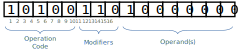

# CPU reference

## Austro Architecture

The simulated Austro CPU is, for educational reasons, based on Intel 8086.

In the following you can see the CPU Block Diagram and a brief depiction of key points of the architecture.

### 16 bits

The Austro CPU works with a [memory word]{target=_blank} of 16 bits (2 bytes). This means for the CPU some things:

- The registers, the internal memory of the CPU, must have (each) 16 bits as well.
- The largest block that can be transferred to and from the memory is of 16 bits.
- The maximum RAM the computer can work is 2^16^ bytes, which is 64 KB.

[memory word]: https://en.wikipedia.org/wiki/Word_(computer_architecture)

/// note | You must be kidding!!!
Nowadays when we can found 64-bit processors even on a cell phone, defining a 16-bit one sounds like a waste of time.

You would probably be right, if this was a real CPU 😏
///

### Instruction Word

## Operations

--8<-- "assembly-ref.html"

## Registers

TBD
